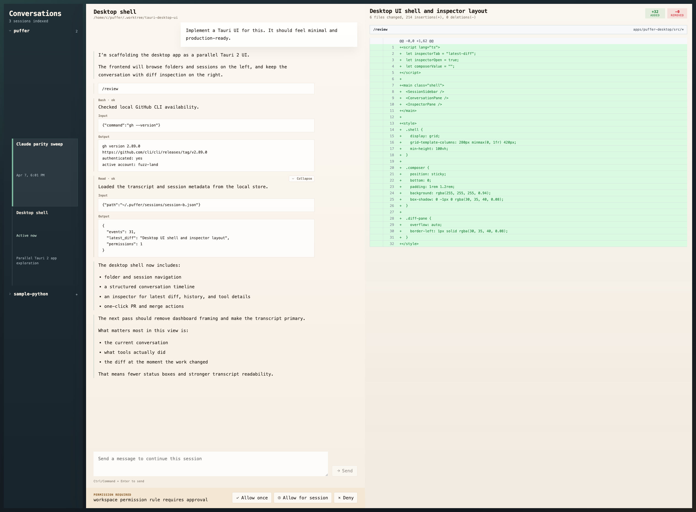
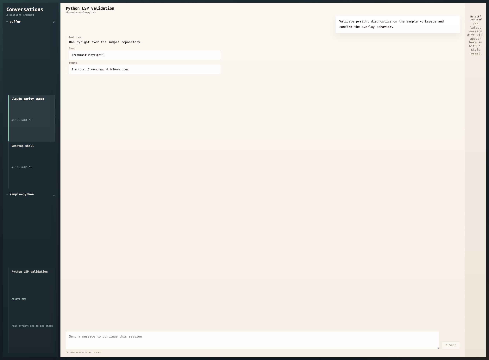

# Desktop UI

Current reference screenshots for the desktop workspace.

## Desktop Shell

Dense coding session with transcript, structured tool records, compact diff checkpoints in-flow, composer, and the diff review rail.

## No Diff State

Session with no captured diff. The transcript remains primary while the diff rail collapses into a narrow empty note.
